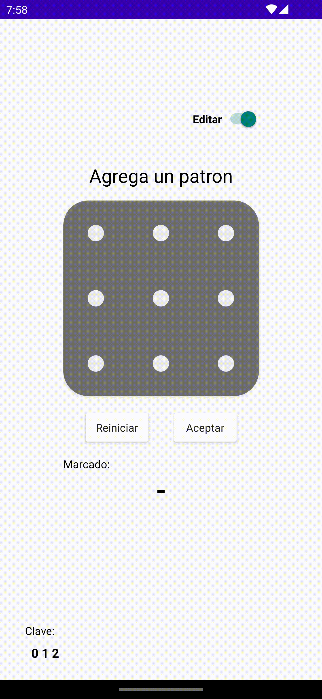
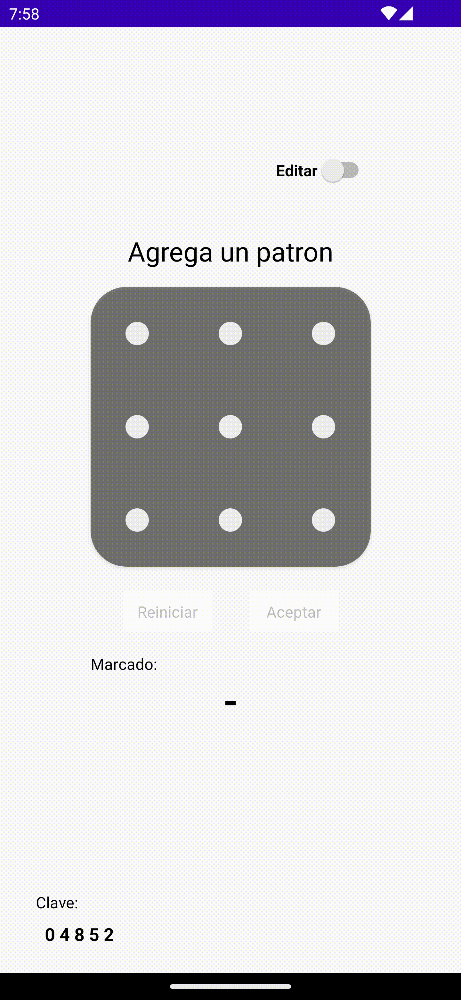

# Modulo de Seguridad de Patron

Seguridad de patrón implementado en java basado en [l7naive/pattern-lock](https://github.com/l7naive/pattern-lock) implementa un controlador para el manejo interno mediante un ViewMode

Esta adaptación fue desarrollada el 2022
## Muestra

<ul style="float:left">
    
    
</ul>

